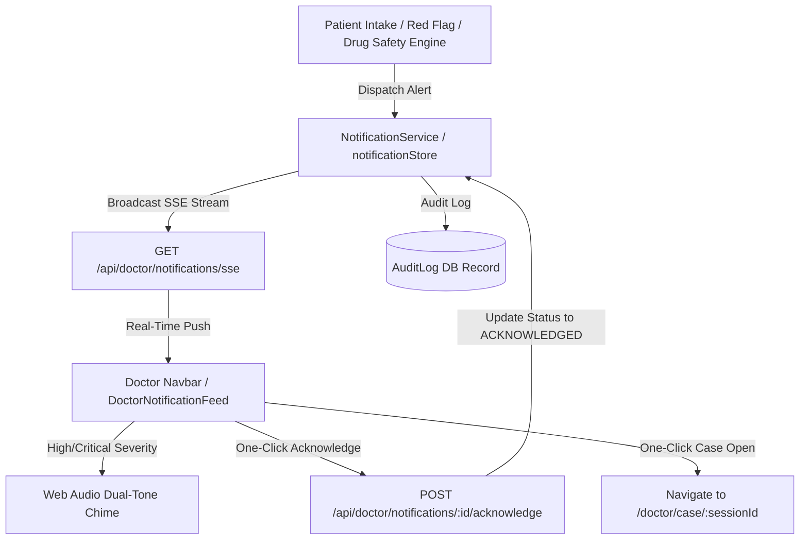

# Real-Time Clinical Event & Emergency Notification Architecture

**Smart India Hackathon 2026 – Problem ID 26047 (Ministry of Ayush / AIIA)**

---

## ⚡ 1. Overview & Operational Architecture

The **AyurSetu Real-Time Notification & Triage Alert Engine** ensures on-duty physicians, Vaidyas, and OPD nursing staff are instantly alerted whenever critical health events, emergency red flags, severe drug interactions, or new patient submissions occur.



---

## 🚨 2. Notification Data Model & Payload Specification

```typescript
export interface ClinicalNotificationItem {
  id: string;
  type: "RED_FLAG" | "NEW_CASE" | "SAFETY_ALERT" | "SYSTEM";
  severity: "CRITICAL" | "HIGH" | "MEDIUM" | "LOW";
  sessionId?: string;
  patientName: string;
  tokenNumber?: string;
  chiefComplaint?: string;
  title: string;
  message: string;
  status: "UNREAD" | "READ" | "ACKNOWLEDGED";
  createdAt: string;
  acknowledgedAt?: string | null;
  acknowledgedBy?: string | null;
  metadata?: Record<string, any>;
}
```

### Example 1: Critical Red Flag Payload
```json
{
  "id": "notif-1740941829000-fa12",
  "type": "RED_FLAG",
  "severity": "CRITICAL",
  "sessionId": "b8f66827-0bb9-44be-9cfc-084a441364d9",
  "patientName": "रवि कुमार (Ravi Kumar)",
  "tokenNumber": "#AYUR-B8F6",
  "chiefComplaint": "छाती में तेज दर्द और बाएं हाथ में खिंचाव (Crushing chest pain)",
  "title": "🚨 आपातकालीन रेड-फ्लैग: तीव्र कोरोनरी सिंड्रोम (Critical ACS Alert)",
  "message": "Patient reports acute crushing chest pain radiating to left arm with diaphoresis (Rule: RF_ACS_RADIATION).",
  "status": "UNREAD",
  "createdAt": "2026-08-31T00:15:00.000Z",
  "metadata": { "ruleId": "RF_ACS_RADIATION" }
}
```

### Example 2: Drug Safety Alert Payload
```json
{
  "id": "notif-1740941830000-88bc",
  "type": "SAFETY_ALERT",
  "severity": "CRITICAL",
  "sessionId": "c9a12831-2ff1-45bc-82aa-112233445566",
  "patientName": "सुमन देवी (Suman Devi)",
  "tokenNumber": "#AYUR-C9A1",
  "chiefComplaint": "Severe Joint pain",
  "title": "⚠️ Critical Drug Interaction: Warfarin + Aspirin",
  "message": "Concurrent administration of Warfarin and Aspirin significantly increases major GI bleeding risk.",
  "status": "UNREAD",
  "createdAt": "2026-08-31T00:15:10.000Z",
  "metadata": { "category": "DRUG_DRUG", "recommendedAction": "Substitute with non-interacting analgesic" }
}
```

---

## 🛠️ 3. Real-Time Delivery & Features

1. **Server-Sent Events (SSE) Stream**:
   - `GET /api/doctor/notifications/sse` broadcasts live updates with connection keep-alive heartbeats every 15 seconds.
   - Dual-layer delivery: Automatic fallback to periodic background polling (every 5 seconds) if SSE connection drops.
2. **Persistent Header Bell & Badge Counter**:
   - Prominently placed in the global navbar for doctors and hospital administrators.
   - Real-time badge counter reflecting unacknowledged notifications, pulsing red when critical items are present.
3. **Emergency Audio Chimes**:
   - Synthesized natively via HTML5 Web Audio API (dual-tone high alert: 880Hz -> 1174Hz).
   - Fully controllable by physician (audio mute/unmute toggle in header drawer).
4. **One-Click Actions**:
   - **देखा (Acknowledge)**: Calls `POST /api/doctor/notifications/:id/acknowledge`, immediately decrements badge counter, and logs `DOCTOR_NOTIFICATION_ACKNOWLEDGED` in the HIPAA/DPDP audit trail.
   - **केस खोलें (Open Case)**: Instantly navigates physician to `/[locale]/doctor/case/[sessionId]`.
5. **Real-Time Queue Invalidation**:
   - Doctor triage desk (`/doctor`) automatically refreshes its queue view upon receiving new case notifications without needing full page reload.

---

## 📑 4. API Endpoints Reference

| Endpoint | Method | Role | Description |
|---|---|---|---|
| `/api/doctor/notifications` | `GET` | Doctor / Admin | Retrieves all active notifications, unread count, and critical count. |
| `/api/doctor/notifications` | `POST` | Doctor / Admin | Bulk marks all alerts as read or acknowledges specific notification. |
| `/api/doctor/notifications/:id/acknowledge` | `POST` | Doctor / Admin | One-click acknowledgment for notification `:id` with audit logging. |
| `/api/doctor/notifications/sse` | `GET` | Doctor / Admin | Live Server-Sent Events stream for instant push delivery. |
