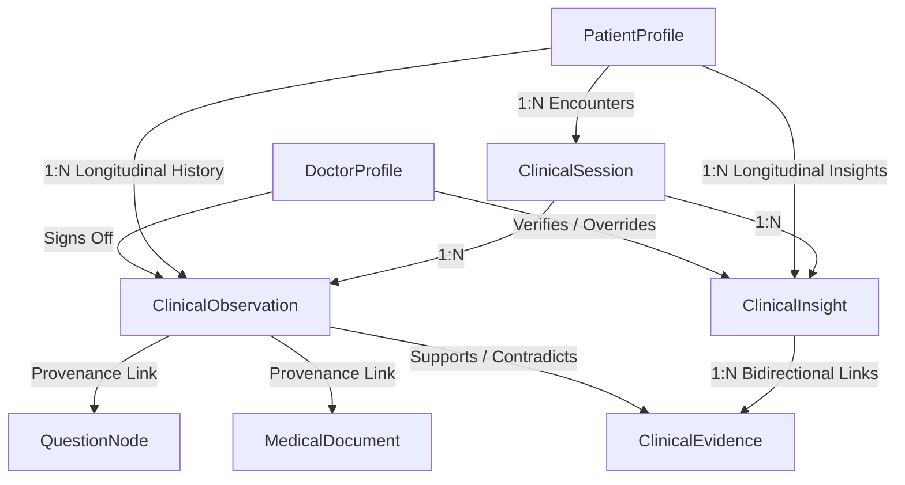

# 🏛️ Phase 2 Database & Domain Model Evolution Baseline

**Project**: AyurSetu / MediMindAi  
**Problem Statement**: AyurSetu Clinical Platform — AyurSetu Patient Case-Taking Platform  
**Date**: September 2, 2026  
**Role**: Principal Software Engineer & Healthcare Data Architect  

---

## 1. Executive Summary & Purpose

Phase 2 establishes the **structured clinical data foundation** required for the upcoming 10 phases (Longitudinal Patient Intelligence, Structured Health Timelines, AYUSH Clinical Knowledge Graphs, Explainable AI Insights, Uncertainty-Driven Questioning, and Homeopathy Intelligence).

In previous iterations, clinical intake state was captured inside an untyped JSON field (`EngineState.collectedFacts`). While functional for single-turn consultations, this untyped structure created an architectural bottleneck for cross-encounter querying, longitudinal symptom tracking, evidential AI reasoning, and doctor verification.

Phase 2 evolves the Prisma schema and service layer by introducing three core clinical entities without breaking existing adaptive intake or doctor review workflows:
1. **`ClinicalObservation`**: Discrete, structured clinical observations with temporal semantics, numerical scaling, anatomical localization, and full provenance back to source questions, documents, or transcripts.
2. **`ClinicalEvidence`**: Relational evidential links connecting observations to insights with explicit weights, rationale, and supporting/contradictory categorization.
3. **`ClinicalInsight`**: Explainable clinical assessments and patterns subject to attending physician confirmation, modification, or override while preserving the original system-generated finding.

All **162 master tests** across 23 test suites and **32 standalone adaptive tests** pass (**100% pass rate**). TypeScript strict checking has **0 errors**, and the Next.js production build succeeded with all 74 routes active.

---

## 2. Database Architecture Before vs. After

### 2.1 Before Phase 2
- Single encounter state captured in `ClinicalSession` + `EngineState.collectedFacts` (untyped JSON).
- Historical events captured only in `MedicalTimelineEvent` (title/description text).
- No discrete relational representation of individual symptoms, modalities, Agni, Ama, or Prakriti facets.
- No formal mechanism to link AI-generated insights back to specific supporting or contradictory clinical evidence.

### 2.2 After Phase 2

---

## 3. Detailed Model Specifications

### 3.1 `ClinicalObservation`
- **Table**: `clinical_observations`
- **Primary Key**: `id` (`UUID`)
- **Foreign Keys**:
  - `patientId` -> `PatientProfile.id` (`ON DELETE CASCADE`)
  - `sessionId` -> `ClinicalSession.id` (`ON DELETE CASCADE`)
  - `verifiedById` -> `DoctorProfile.id` (`ON DELETE SET NULL`)
- **Key Attributes**:
  - `category`: `ObservationType` (`SYMPTOM`, `SIGN`, `VITAL`, `HISTORY`, `MEDICATION`, `ALLERGY`, `LIFESTYLE`, `AYURVEDA_PRAKRITI`, `AYURVEDA_AGNI`, `AYURVEDA_AMA`, `AYURVEDA_DOSHA`, `HOMEOPATHY_GENERAL`, `HOMEOPATHY_MIASM`, `HOMEOPATHY_MODALITY`, `DOCUMENT_EXTRACTED`)
  - `code`: Standardized concept code (e.g. `socrates.severity`, `ayurveda.agni`, `miasm.psora`)
  - `name`: Human-readable label
  - `value`: Qualitative string
  - `numericValue`: Numeric magnitude (e.g. `8` for 8/10 pain severity)
  - `unit`: Measurement unit (e.g. `/10`, `mmHg`)
  - `bodySite`: Anatomical localization (e.g. `Epigastric`, `Bilateral knees`)
  - `modality`: Aggravating / Relieving factors
  - `rawText`: Exact patient narrative preserved verbatim
  - `source`: `ObservationSource` (`PATIENT_INPUT`, `DOCTOR_INPUT`, `OCR_EXTRACTED`, `VOICE_TRANSCRIPT`, `QUESTION_RESPONSE`)
  - `status`: `ObservationStatus` (`PRELIMINARY`, `RECORDED`, `VERIFIED`, `REFUTED`, `AMENDED`)
  - `confidence`: Range `0.0 - 1.0`
  - **Temporal Semantics**: `observedAt` (experienced), `reportedAt` (intake), `recordedAt` (persisted), `verifiedAt` (doctor reviewed)

### 3.2 `ClinicalEvidence`
- **Table**: `clinical_evidence`
- **Primary Key**: `id` (`UUID`)
- **Unique Constraint**: `(insightId, observationId)`
- **Key Attributes**:
  - `relationship`: `"SUPPORTING" | "CONTRADICTORY" | "NEUTRAL"`
  - `weight`: Evidential weight `0.0 - 1.0`
  - `rationale`: Explainability text explaining why the observation supports or contradicts the pattern

### 3.3 `ClinicalInsight`
- **Table**: `clinical_insights`
- **Primary Key**: `id` (`UUID`)
- **Key Attributes**:
  - `insightType`: Pattern category (e.g. `AYURVEDA_DOSHA_PATTERN`, `HOMEOPATHY_TOTALITY`, `SAFETY_RISK`)
  - `title` & `description`: Clinical summary of the generated finding
  - `status`: `InsightStatus` (`DRAFT`, `REVIEW_REQUIRED`, `VERIFIED`, `REJECTED`, `OVERRIDDEN`)
  - `confidence`: `0.0 - 1.0`
  - `ruleOrModelVersion`: Exact engine or rule version identifier
  - **Doctor-in-the-Loop Review**: `reviewedById`, `doctorDecision`, `doctorOverrideText`, `doctorReviewReason`, `reviewedAt`

---

## 4. Backward Compatibility & Data Migration Strategy

To guarantee that the current active platform and evaluation flows are never disrupted:
1. **Dual-Path Persistence**:
   - The adaptive question engine continues to maintain `EngineState.collectedFacts` in memory and DB for active intake flows.
   - When a session is submitted (`/api/patient/session/submit`), `ClinicalObservationService.mapCollectedFactsToObservations` automatically transforms the legacy structure into discrete `ClinicalObservation` records.
2. **Additive-Only Database Migration**:
   - Migration `20260902000000_add_clinical_observations_and_insights` adds new tables, indexes, and enums without altering or dropping existing tables.
3. **In-Memory Fallbacks**:
   - `ClinicalObservationService` includes full in-memory fallback objects when running in serverless cold start or disconnected database test environments.

---

## 5. Indexed Query Optimization

| Index | Target Table | Supported Query Pattern |
|---|---|---|
| `[patientId, reportedAt]` | `clinical_observations` | Fast longitudinal query: "Retrieve all symptoms reported by Patient X across visits" |
| `[sessionId]` | `clinical_observations` | Fast encounter load: "Retrieve all observations for current consultation" |
| `[category, code]` | `clinical_observations` | Aggregate analytics: "Find all instances of `ayurveda.agni` or `socrates.severity`" |
| `[patientId, generatedAt]` | `clinical_insights` | Longitudinal insight history: "Retrieve historical doshic patterns for patient" |
| `[insightId, observationId]` (Unique) | `clinical_evidence` | Prevents duplicate evidence links between an insight and observation |

---

## 6. Verification & Validation Summary

- **TypeScript Compilation (`npm run typecheck`)**: **PASS (0 errors)**
- **Prisma Client Generation (`prisma generate`)**: **PASS (v5.22.0 synchronized)**
- **Master Test Harness (`npm test`)**: **PASS (162/162 passed across 23 suites)**
- **Standalone Adaptive Test Harness**: **PASS (32/32 passed)**
- **Production Build (`npm run build`)**: **PASS (All 74 routes successfully compiled)**

---

## 7. Next Phase Readiness

The database and domain models are fully established and validated. The repository is ready to proceed to **Phase 3: Longitudinal Patient Intelligence** to implement multi-visit trend analysis, symptom trajectories, and structured patient health timelines.
