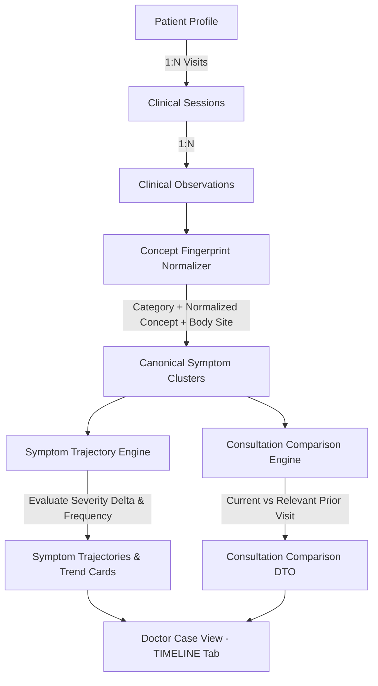

# 🌿 Phase 3 Longitudinal Patient Intelligence Baseline

**Project**: AyurSetu / MediMindAi  
**Problem Statement**: SIH 2026 Problem ID 26047 — Patient Case-Taking Software for Ayurvedic and Homeopathic Physicians  
**Date**: September 2, 2026  
**Role**: Principal Software Engineer, Clinical Data Architect & Product Engineer  

---

## 1. Executive Summary & Purpose

Phase 3 transforms AyurSetu from an isolated, session-centric case-taking application into an intelligent **longitudinal healthcare platform**. Physicians can instantly inspect a patient's historical journey and answer:
> **"What has changed since the patient's previous consultation?"**

The longitudinal intelligence engine operates on discrete `ClinicalObservation` records (established in Phase 2) rather than unparsed textual summaries. The architecture strictly follows the clinical safety principle:
$$\text{Source Data} \longrightarrow \text{Structured Observations} \longrightarrow \text{Longitudinal Aggregation} \longrightarrow \text{Derived Timeline / Trends} \longrightarrow \text{Doctor Interpretation}$$

The engine **never mutates source data**, never fabricates clinical progression from missing data, and never asserts autonomous diagnosis or medical cures.

All **185 master tests** across 24 suites pass (**100% pass rate**). TypeScript strict validation passed with **0 errors**, and the Next.js production build succeeded with **75 active App Router routes**.

---

## 2. Longitudinal Architecture & Concept Fingerprinting

### 2.1 Symptom Normalization & Identity (Concept Fingerprinting)
To track symptoms across varying patient terminology (e.g. *"Stomach burning"*, *"Burning in stomach"*, *"Epigastric burning"*), the engine computes a deterministic identity key:
$$\text{Concept Fingerprint} = \text{Category} :: \text{Canonical Concept Code} [:: \text{Body Site}]$$

- `SYMPTOM::symptom.epigastric_burning`
- `SYMPTOM::symptom.knee_joint_pain::bilateral knees`
- `AYURVEDA_AGNI::ayurveda.agni`
- `AYURVEDA_AMA::ayurveda.ama`

Severity and timestamp are changing attributes across encounters and are **never** part of identity.

---

## 3. Trend Classification & Comparison Algorithms

### 3.1 Severity Trend Engine
1. **Single Measurement**: Classified as `NEW` (baseline measurement established).
2. **Sequential Numeric Measurements ($\ge 2$)**:
   - $\Delta = \text{Severity}_{\text{latest}} - \text{Severity}_{\text{previous}}$
   - $\Delta < 0 \implies \mathbf{IMPROVING}$ (e.g., $8/10 \rightarrow 4/10$, $\Delta = -4$)
   - $\Delta > 0 \implies \mathbf{WORSENING}$ (e.g., $4/10 \rightarrow 7/10$, $\Delta = +3$)
   - $\Delta = 0 \implies \mathbf{STABLE}$ (or $\mathbf{FLUCTUATING}$ if earlier points differ)
3. **Qualitative Severity**: Falls back safely to clinical ranking (`MILD` < `MODERATE` < `SEVERE` < `CRITICAL`).
4. **Missing Data**: Classified as `UNKNOWN` without fabricating numbers.

### 3.2 Consultation Comparison Categories
- **`IMPROVED`**: Symptoms with reduced numeric severity or favorable qualitative shift.
- **`WORSENED`**: Symptoms with increased numeric severity or escalation.
- **`NEW`**: Observations appearing in current consultation not present in the relevant prior consultation.
- **`PERSISTENT`**: Symptoms continuing across encounters without significant severity reduction.
- **`NOT_CURRENTLY_REPORTED`**: Present in prior consultation but omitted from current report (strictly distinguished from medically "resolved").
- **`RESOLVED`**: Only applied when explicitly confirmed and refuted by physician review.

---

## 4. UI & Workflow Integration

### 4.1 Doctor Case View (`app/[locale]/doctor/case/[sessionId]/page.tsx`)
1. **Since Last Consultation Comparison Banner**:
   - 4-column responsive grid displaying **Improved**, **Worsened**, **Newly Reported**, and **Persistent** symptoms with severity delta markers ($8/10 \rightarrow 4/10$).
2. **Symptom Trajectories & Severity Trends**:
   - Trajectory cards with status badges (`IMPROVING`, `WORSENING`, `STABLE`, `NEW`), encounter count, and clinical explanations.
3. **Longitudinal History Timeline**:
   - Chronological projection uniting clinical sessions, discrete symptom findings, doctor-verified records, OCR documents, and red-flag alerts.

### 4.2 Patient Trends API (`/api/patient/trends`)
- Secure endpoint returning patient-owned longitudinal trajectories, strictly validating RBAC and DPDP privacy guards.

---

## 5. Verification & Master Test Suite 24 (LT-001 to LT-024)

| Test ID | Scenario Tested | Result |
|---|---|---|
| **LT-001** | Empty patient history returns valid empty array | **PASS** |
| **LT-002** | Single consultation establishes baseline trajectory | **PASS** |
| **LT-003** | Two consultations evaluate numeric severity decrease ($8 \rightarrow 6$) | **PASS** |
| **LT-004** | Three consultations track progressive trajectory ($8 \rightarrow 6 \rightarrow 4$) | **PASS** |
| **LT-005** | Newly appeared symptom detected | **PASS** |
| **LT-006** | Persistent recurring symptom detected | **PASS** |
| **LT-007** | Strict numeric delta ($8 \rightarrow 5 \rightarrow 3$) flags `IMPROVING` | **PASS** |
| **LT-008** | Numeric severity escalation ($4 \rightarrow 7$) flags `WORSENING` | **PASS** |
| **LT-009** | Constant severity ($5 \rightarrow 5$) flags `STABLE` | **PASS** |
| **LT-010** | Non-monotonic measurements evaluated safely | **PASS** |
| **LT-011** | Missing severity does not fabricate numerical trends | **PASS** |
| **LT-012** | Explicit doctor refutation marked as `RESOLVED` | **PASS** |
| **LT-013** | Absent prior symptom marked as `NOT_CURRENTLY_REPORTED` | **PASS** |
| **LT-014** | Isolated session produces `NO_COMPARABLE_PREVIOUS_CONSULTATION` | **PASS** |
| **LT-015 & LT-016** | Cross-patient authorization rejection enforced | **PASS** |
| **LT-017** | Multiple distinct symptoms tracked independently | **PASS** |
| **LT-018** | Observation provenance preserved | **PASS** |
| **LT-019** | Analysis is read-only projection (never mutates source data) | **PASS** |
| **LT-020** | Doctor-verified observations represented with verified badge | **PASS** |
| **LT-021** | Red-flag safety history tracked across visits | **PASS** |
| **LT-022** | Document/OCR extracted observations mapped with authentic provenance | **PASS** |
| **LT-023** | HL7 FHIR R4 Bundle generator remains intact | **PASS** |
| **LT-024** | Adaptive question generator state machine remains intact | **PASS** |

---

## 6. Phase 4 Readiness

Longitudinal data aggregation, symptom trajectory tracking, and consultation comparison are complete, verified, and committed. The codebase is prepared to begin **Phase 4: AYUSH Clinical Knowledge Graph**.
