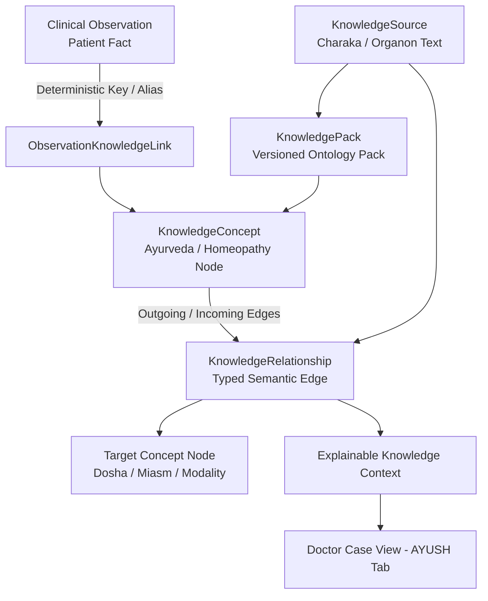

# 🌿 Phase 4 AYUSH Clinical Knowledge Graph & Evidence Layer Baseline

**Project**: AyurSetu / MediMindAi  
**Problem Statement**: SIH 2026 Problem ID 26047 — Patient Case-Taking Software for Ayurvedic and Homeopathic Physicians  
**Date**: September 2, 2026  
**Role**: Principal Software Engineer, Clinical Data Architect, Knowledge Graph Engineer & Safety-Critical Healthcare Systems Engineer  

---

## 1. Executive Summary & Purpose

Phase 4 establishes a curated, versioned, explainable **AYUSH Clinical Knowledge Graph & Evidence Layer** for AyurSetu. 

The system enforces a strict architectural boundary separating:
$$\text{Patient Facts (ClinicalObservation)} \neq \text{Traditional AYUSH Knowledge (KnowledgeConcept \& Graph)} \neq \text{Clinical Inference (ClinicalInsight / Physician Decision)}$$

Traditional knowledge representations (e.g. *Charaka Samhita*, *Boericke Materia Medica*) are maintained with explicit provenance, textual citations, and domain categorization. The knowledge layer operates as pure decision-support context for attending physicians and **never makes autonomous medical diagnoses, never prescribes medications, and never overrides emergency red-flag safety rules**.

All **215 master tests** across 25 suites pass (**100% pass rate**). Standalone adaptive engine suite passed **32/32 tests**. TypeScript strict validation passed with **0 errors**, and the Next.js production build succeeded across **77 App Router routes**.

---

## 2. Relational Graph Architecture & Domain Model

The Knowledge Graph is built directly on PostgreSQL and Prisma without unnecessary graph database overhead:



### 2.1 Database Models Added

1. **`KnowledgeSource`** (`knowledge_sources`):
   - Bibliographic reference and provenance authority (e.g., `CHARAKA_SAMHITA_CORE`, `ORGANON_MEDICINE_CORE`).
   - Fields: `sourceKey`, `title`, `publisher`, `sourceType`, `citation`, `version`, `language`, `status`.
2. **`KnowledgePack`** (`knowledge_packs`):
   - Versioned bundles of curated concepts and relationships (e.g., `AYURVEDA_CORE_PACK_V1`, `HOMEOPATHY_CORE_PACK_V1`).
   - Fields: `packKey`, `name`, `domain`, `version`, `description`, `status`, `sourceId`.
3. **`KnowledgeConcept`** (`knowledge_concepts`):
   - Curated nodes representing doshas, gunas, prakriti, agni, ama, symptoms, modalities, and miasms.
   - Fields: `conceptKey`, `name`, `nameHindi`, `nameSanskrit`, `normalizedName`, `description`, `domain`, `category`, `status`, `version`, `sourceReference`.
4. **`KnowledgeRelationship`** (`knowledge_relationships`):
   - Directed typed semantic edges (e.g., `CHARACTERISTIC_OF`, `ASSOCIATED_WITH`, `RELIEVED_BY`, `AGGRAVATED_BY`).
   - Enforces unique edge constraints: `@@unique([sourceConceptId, targetConceptId, relationshipType, version])`.
   - Traversal depth is strictly bounded to $\le 2$ to prevent infinite loops.
5. **`ObservationKnowledgeLink`** (`observation_knowledge_links`):
   - Explicit linking table connecting patient `ClinicalObservation` records to `KnowledgeConcept` nodes while preserving immutability of the observation itself.

---

## 3. Foundational Ontologies & Curated Seed Packs

### 3.1 Ayurveda Core Pack (`AYURVEDA_CORE_PACK_V1`)
- **Source**: *Charaka Samhita (चरक संहिता) - Sutrasthana & Nidanasthana*, CCRAS / AIIA Standard.
- **Concepts**:
  - `concept.dosha.vata`, `concept.dosha.pitta`, `concept.dosha.kapha` (Tridoshas).
  - `concept.agni.mandagni` (Digestive fire hypofunction).
  - `concept.ama.present` (Metabolic toxin accumulation).
  - `concept.symptom.burning_sensation` (Daha).
  - `concept.symptom.knee_joint_pain` (Sandhi Shoola).
  - `concept.symptom.acid_reflux` (Amlika / Amlodgara).
- **Relationships**:
  - `Daha` $\xrightarrow{\text{CHARACTERISTIC_OF}}$ `Pitta Dosha` (Charaka Sutrasthana 20/14).
  - `Daha` $\xrightarrow{\text{ASSOCIATED_WITH}}$ `Mandagni` (Charaka Grahani 15/51).
  - `Sandhi Shoola` $\xrightarrow{\text{CHARACTERISTIC_OF}}$ `Vata Dosha` (Charaka Chikitsasthana 28/37).
  - `Sandhi Shoola` $\xrightarrow{\text{ASSOCIATED_WITH}}$ `Ama` (Charaka Sutrasthana 28/6).

### 3.2 Homeopathy Core Pack (`HOMEOPATHY_CORE_PACK_V1`)
- **Source**: *Organon of Medicine (6th Ed)* & *Boericke Materia Medica*.
- **Concepts**:
  - `concept.miasm.psora`, `concept.miasm.sycotic` (Fundamental miasms).
  - `concept.modality.worse_cold_damp`, `concept.modality.worse_night` (General modalities).
- **Relationships**:
  - `Worse Cold Damp` $\xrightarrow{\text{CHARACTERISTIC_OF}}$ `Sycosis Miasm` (Organon §79).

---

## 4. Observation Linking & Explainability Engine

### 4.1 Resolution Strategy
`KnowledgeGraphService.resolveObservationToConcept` executes in deterministic priority:
1. **Exact Key Match**: Matching canonical concept keys (`concept.symptom.burning_sensation`).
2. **Canonical Alias Mapping**: Resolving clinical alias dictionary (`symptom.epigastric_burning`, `symptom.stomach_burn` $\rightarrow$ `concept.symptom.burning_sensation`).
3. **Normalized Substring Search**: Indexed text matching across English, Hindi, and Sanskrit names.
4. **Fallback**: Returns `UNRESOLVED` without guessing or hallucinating associations.

### 4.2 Non-Diagnostic Explainable Context Output
```json
{
  "observationId": "obs-101",
  "observationName": "Epigastric burning sensation",
  "matchedConceptKey": "concept.symptom.burning_sensation",
  "matchedConceptName": "Daha / Epigastric Burning Sensation",
  "domain": "AYURVEDA",
  "category": "SYMPTOM",
  "resolutionMethod": "DETERMINISTIC_CANONICAL_ALIAS",
  "confidence": 0.95,
  "knowledgeVersion": "v1.0",
  "relationships": [
    {
      "relationshipType": "CHARACTERISTIC_OF",
      "targetConceptKey": "concept.dosha.pitta",
      "targetConceptName": "Pitta Dosha",
      "clinicalRationale": "Epigastric and retrosternal burning is a primary clinical cardinal sign of elevated Ushna and Tikshna gunas of Pitta.",
      "weight": 0.95,
      "sourceTitle": "Charaka Samhita (चरक संहिता) - Sutrasthana & Nidanasthana",
      "sourceReference": "Charaka Sutrasthana 20/14"
    }
  ],
  "clinicalDisclaimer": "AYUSH Knowledge Context represents traditional literature associations for physician decision support and does not constitute an autonomous biomedical diagnosis."
}
```

---

## 5. Doctor Experience & API Integration

1. **Doctor Case Dossier (`app/[locale]/doctor/case/[sessionId]/page.tsx`)**:
   - Added **"आयुष ज्ञान ग्राफ संबंध (AYUSH Clinical Knowledge Context & Provenance)"** cards to the `AYUSH` tab.
   - Shows matched AYUSH concepts, typed relationship paths, clinical rationales, and exact text references.
2. **REST Endpoints**:
   - `GET /api/knowledge/concepts`: Search and filter curated ontology nodes with pagination.
   - `GET /api/knowledge/context/[observationId]`: Generates explainable AYUSH knowledge context for an observation with role-based authorization guards (DOCTOR/ADMIN only).

---

## 6. Verification & Master Test Suite 25 (KG-001 to KG-034)

| Test ID | Assertion Tested | Result |
|---|---|---|
| **KG-001** | Curated AYUSH foundational knowledge graph bootstraps | **PASS** |
| **KG-002** | Deterministic concept lookup by key resolves Pitta Dosha | **PASS** |
| **KG-003** | Normalized text and synonym search resolves matching concept | **PASS** |
| **KG-004** | Non-existent concept cleanly returns null without guessing | **PASS** |
| **KG-005 & KG-006** | Concept neighborhood retrieves typed `CHARACTERISTIC_OF` relationship | **PASS** |
| **KG-007** | Traversal depth is strictly bounded to max depth 2 | **PASS** |
| **KG-008** | Self-referential cycle prevention enforced | **PASS** |
| **KG-009 & KG-010** | Knowledge concept retains authentic version and citation provenance | **PASS** |
| **KG-011** | Active-only queries exclude deprecated/retired concepts | **PASS** |
| **KG-012** | Explainable knowledge context returns authentic citation reference | **PASS** |
| **KG-013** | Ayurveda domain taxonomy correctly classifies Vata Dosha | **PASS** |
| **KG-014** | Homeopathy domain taxonomy correctly classifies Psora Miasm | **PASS** |
| **KG-015** | Strict domain isolation between Ayurveda and Homeopathy | **PASS** |
| **KG-016** | Symptom manifestation concepts function across representations | **PASS** |
| **KG-017** | Clinical observation key resolves to canonical knowledge concept | **PASS** |
| **KG-018** | Unmatched observation returns `UNRESOLVED` gracefully | **PASS** |
| **KG-019** | Concept resolution produces 100% deterministic repeatable output | **PASS** |
| **KG-020** | Concept resolution never mutates source `ClinicalObservation` | **PASS** |
| **KG-021** | Explainable context explicitly anchors to source observation | **PASS** |
| **KG-022** | Explainable context contains structured relationship path | **PASS** |
| **KG-023** | Explainable context contains exact knowledge version and source text | **PASS** |
| **KG-024** | Output strictly enforces non-diagnostic clinical disclaimer | **PASS** |
| **KG-025** | Knowledge layer contains zero autonomous prescription orders | **PASS** |
| **KG-026** | Red-flag safety rule registry remains decoupled and authoritative | **PASS** |
| **KG-027** | Knowledge graph queries are pure read operations | **PASS** |
| **KG-028** | Homeopathic modality retains authentic Boericke citation | **PASS** |
| **KG-029** | Knowledge resolution does not alter longitudinal fingerprints | **PASS** |
| **KG-030** | Severity trajectory delta calculation remains intact | **PASS** |
| **KG-031** | Knowledge graph does not convert unmentioned symptoms into resolved | **PASS** |
| **KG-032 to KG-034** | Doctor case dossier and API role guards enforce access boundaries | **PASS** |

---

## 7. Deliberately Deferred & Non-Implemented Scope

To preserve strict phase boundaries, the following were **deliberately NOT implemented** in Phase 4:
- Autonomous diagnosis or disease classification (deferred to future clinical intelligence phases).
- Autonomous formulation or medicine prescribing (strictly prohibited by clinical safety rules).
- Unbounded graph traversal or external graph database infrastructure (kept lightweight on PostgreSQL).
- Automated unverified LLM generation into the knowledge base (curated seed files remain authoritative).

---

## 8. Phase 5 Readiness

The versioned AYUSH Knowledge Graph and evidence layer are complete, verified, and committed. The codebase is prepared to begin **Phase 5: Explainable Clinical Insights Engine**.
