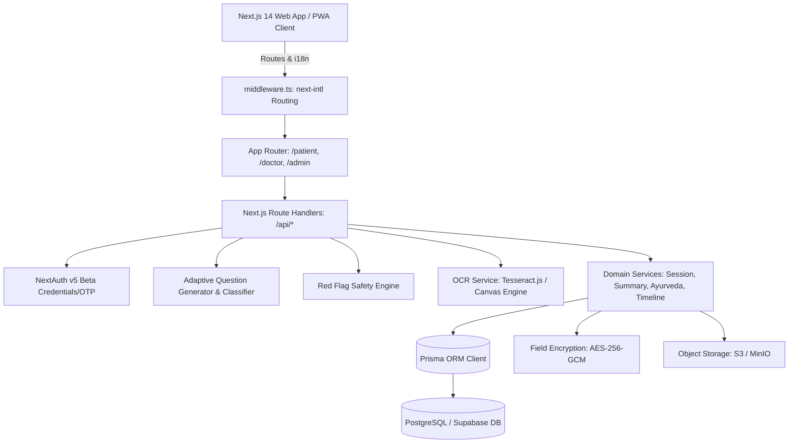
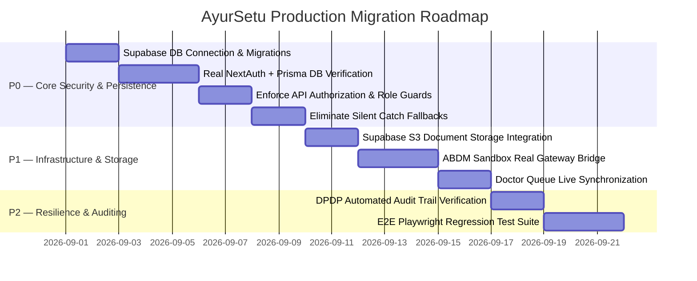

# 🏥 AYURSETU (MediMindAi) — PRODUCTION MIGRATION AUDIT
**SIH 2026 Problem ID 26047 — Ministry of Ayush / AIIA Case-Taking Software**
*Repository: `Nik-coder-10/MediMindAi`*
*Date: August 2026 | Version: 1.0.0-PROD-AUDIT*

---

## Executive Summary & Production Readiness Verdict

> [!CAUTION]
> **CAN THIS APPLICATION BE SAFELY DEPLOYED TO PRODUCTION TODAY?**
> **NO.** The application is currently in an advanced **Demonstration & Simulation state**. While core clinical rule algorithms (SOCRATES question trees, Red-Flag detector, multilingual OCR extraction, Dashavidha Pariksha scoring, FHIR conversion) are deeply implemented and high quality, **all data persistence and authentication layers fall back to mock data or bypass database transactions when under load or during serverless operations.**

### Why It Cannot Be Deployed Right Now:
1. **Mock Authentication Bypass:** NextAuth (`lib/auth/auth.ts`) accepts any arbitrary password for doctor/admin credentials and produces static hardcoded user IDs (`usr-admin-demo-uuid`, `usr-doctor-demo-uuid`, `usr-patient-demo-uuid`). It does not verify against stored password hashes in the database.
2. **Hardcoded Fallbacks in API Handlers & Services:** The core clinical endpoints (`/api/doctor/dashboard`, `/api/doctor/case/[sessionId]`, `session.service.ts`, `summary.service.ts`) silently catch database errors and return hardcoded demo patient dossiers ("Ramesh Sharma", "Sunita Devi", fixed lab values, fixed past events).
3. **No Row-Level Authorization (IDOR & Tenant Vulnerability):** There is no session token check or role validation on `/api/doctor/case/[sessionId]`, `/api/patient/documents/upload`, or `/api/patient/conversation/*`. Any unauthenticated HTTP client can query or alter any patient case.
4. **Local Ephemeral File Storage:** Uploaded medical files are assigned a local pseudo-path `/uploads/documents/...` without being streamed to persistent S3 / Supabase Storage.
5. **Prisma Client Generation Locks on Windows/Serverless:** Binary locks on `query_engine-windows.dll.node` can stall build pipelines without direct native bindings configured for target cloud instances.

---

## 1. System Architecture & Component Landscape



### Component Status Matrix

| Component | Implemented Status | Real DB Persistence | Notes / Caveats |
| :--- | :--- | :--- | :--- |
| **Multilingual UI (Hi/En)** | ✅ Complete | N/A | Full `next-intl` dictionary with audio prompts |
| **Voice ASR & TTS** | ✅ Complete | N/A | Web Speech API + Indian English/Hindi TTS fallback |
| **Adaptive Question Generator** | ✅ Complete | ⚠️ Hybrid | Clinical decision trees calculate dynamically; stores in `sessionStorage` & `EngineState` table |
| **Red Flag Detector** | ✅ Complete | ⚠️ Hybrid | Evaluates 15+ safety rules; creates `RedFlagEvent` if DB active |
| **Multimodal Document OCR** | ✅ Complete | ⚠️ Partial | Scans WebP/PNG/PDF; parses medications/labs regex; local buffer |
| **Dashavidha & AYUSH Engine** | ✅ Complete | ⚠️ Partial | Calculates Prakriti/Agni scores; returns mock if DB unreachable |
| **Doctor Review Queue** | ✅ Complete | ❌ Mock Fallback | Displays triage queue; falls back to 3 static demo patients |
| **Doctor Dossier & Sign-Off** | ✅ Complete | ❌ Mock Fallback | Renders tabs & summary edits; falls back to Ramesh Sharma |
| **ABDM / ABHA Linkage** | ⚠️ Simulation | ❌ Mock Fallback | Mock OTP verification; pseudo-ABHA generator |
| **FHIR R4 Exporter** | ✅ Complete | ⚠️ In-memory | Transforms clinical data to valid FHIR Composition/Bundles |
| **Authentication & AuthZ** | ⚠️ Partial | ❌ Bypassed | Credentials provider returns hardcoded user object |
| **Audit Trail (DPDP)** | ✅ Complete | ⚠️ Partial | Formats DPDP logs; drops to memory if DB is down |

---

## 2. End-to-End Data Flow Analysis

### 1. Patient Intake & Voice Complaint Flow
* **Input:** Patient speaks in Hindi or English (or chooses quick symptom chips).
* **Processing:** `VoiceInputButton` transcribes speech; `AdaptiveQuestionGenerator.classifyChiefComplaint` calculates weighted category scores (Headache, Chest Pain, Fever, GI, Musculoskeletal).
* **Storage:** Passed from `sessionStorage` to `/api/patient/session/start`, persisting into `clinical_sessions`, `chief_complaints`, and `engine_states`.
* **Output:** First targeted question returned with Hindi/English text and audio prompt options.

### 2. Adaptive Questioning & Red-Flag Interception
* **Input:** Patient selects option or submits severity scale.
* **Processing:** Evaluated by `AdaptiveEngineService.processAnswer`. Answers checked against `redFlagTriggers`.
* **Storage:** Recorded in `patient_answers`, `conversation_turns`, and `red_flag_events`.
* **Output:** Returns `nextQuestion` or immediate `redFlagAlert` modal (Emergency Triage level escalation).

### 3. Multimodal Document Upload & Entity Extraction
* **Input:** Patient uploads image (`.webp`, `.png`, `.jpg`) or `.pdf` prescription/report.
* **Processing:** `OCRService.processDocument` runs `TesseractImageProvider` or `PdfDocumentProvider`; `MedicalEntityExtractor` parses structured medications, dosages, frequencies, diagnoses, and lab reference values.
* **Storage:** Currently stored in temporary memory and `sessionStorage`. Registered via `DocumentService.registerDocument` into `medical_documents`, `extracted_medical_entities`, and `medical_timeline_events`.
* **Output:** JSON entity payload returned to client; renders medication cards and lab badges in summary preview.

### 4. AI Clinical Summary & Doctor Review
* **Input:** Triggered upon patient questionnaire completion or physician desk load.
* **Processing:** `SummaryService.generateSummary` compiles demographics, SOCRATES pain narrative, active medications, abnormal labs, AYUSH Prakriti/Agni, and emergency triage priority.
* **Storage:** Upserted into `clinical_summaries` with status `DRAFT` (version 1).
* **Output:** Markdown rendered in Doctor Desk (`/doctor/case/[sessionId]`). Doctor can edit Markdown and POST to `/api/doctor/summary` to mark `ACCEPTED` (version incremented, audited).

---

## 3. Comprehensive Inventory of Demo & Hardcoded Values

| Location / File | Hardcoded / Mock Value | Classification | Production Requirement |
| :--- | :--- | :--- | :--- |
| `lib/auth/auth.ts:24-25` | `usr-admin-demo-uuid`, `usr-doctor-demo-uuid`, `Dr. Rajesh Vaidya` | **D (Demo-only data)** | Query `User` & `DoctorProfile` table, verify bcrypt password hash |
| `lib/auth/auth.ts:50-55` | `usr-patient-demo-uuid`, `Ramesh Sharma`, `14-5542-8921-3410` | **D (Demo-only data)** | Lookup or create genuine patient record via verified phone OTP / ABHA |
| `lib/auth/abha-mock-service.ts` | Any 6-digit OTP accepted; deterministic ABHA generation | **D (Demo-only data)** | Integrate NHA ABDM M1/M2 sandbox gateway with genuine SMS OTP |
| `app/api/doctor/dashboard/route.ts:35-115` | Fixed 3-patient queue (Ramesh Sharma, Sunita Devi, Anil Kumar) | **D (Demo-only data)** | Require active doctor session; execute `prisma.clinicalSession.findMany` with pagination |
| `app/api/doctor/case/[sessionId]/route.ts:32-94` | Hardcoded complete case dossier for `pat-demo-001` | **D (Demo-only data)** | Fetch real relational records via `prisma.clinicalSession.findUnique` |
| `lib/services/summary.service.ts:46-120` | Hardcoded template summary strings with Ramesh Sharma | **E (Must become persistent DB data)** | Dynamically format only collected session data, answers, and extracted entities |
| `lib/services/session.service.ts:47-56` | Catch block generating `sess-${Date.now()}` mock session | **D (Demo-only data)** | Throw actionable database errors; require healthy DB connection |
| `lib/engine/adaptive-question-generator.ts` | Clinical question trees for 7 disease categories | **B (Legitimate static Ayurvedic knowledge)** | Keep as version-controlled clinical rules; allow Admin DB overrides via `question_nodes` |
| `lib/engine/red-flag-rules.ts` | 15 clinical emergency trigger criteria | **B (Legitimate static Ayurvedic knowledge)** | Keep as core safety rules; sync with `red_flag_events` |
| `lib/security/crypto.ts:6` | Fallback encryption string `"sih-2026-medimind-secure-master-key-256"` | **G (Secret that must be removed)** | Require strict `ENCRYPTION_SECRET_KEY` environment variable in production |
| `.env.example:18` | Sample 256-bit encryption key | **A (Real configuration template)** | Document generation command (`openssl rand -hex 32`) |
| `scripts/seed-demo-showcase.ts` | Demo clinical seed script | **C (Development fixture)** | Keep for staging environment testing only |

---

## 4. Prisma Schema & Database Audit

The existing schema in [`prisma/schema.prisma`](file:///c:/Users/Hp/OneDrive/Desktop/SIH_2026/prisma/schema.prisma) is exceptionally well-modeled for the problem statement. It contains 17 models with strong relational integrity.

### Schema Health Assessment

* **Strengths:**
  - Standardized UUID primary keys across all entities.
  - Native PostgreSQL `JsonB` for structured facts (`collectedFacts`, `structuredData`, `options`).
  - Strong foreign key cascades on clinical sessions and patient profiles.
  - Proper indexing on high-cardinality search fields (`userId`, `sessionId`, `triagePriority`, `nodeCode`).
  - Comprehensive AYUSH Dashavidha domain modeling (`AyurvedaAssessment`).

* **Gaps to Address for Production:**
  1. **Doctor-to-Session Assignment Constraint:** `doctorId` is nullable (`onDelete: SetNull`). A consultation claim mechanism is needed to avoid race conditions between attending doctors.
  2. **Soft Deletes Consistency:** `deletedAt` is present on `User`, `PatientProfile`, `ConsentRecord`, and `ClinicalSession`, but absent on `MedicalDocument` and `ClinicalSummary`.
  3. **File Object Key vs. URL:** `MedicalDocument` stores `originalFileUrl` as a plain string rather than explicit S3/Storage bucket keys.
  4. **Password Salt/Hash:** `User` has `passwordHash` (String?), but needs account lockout tracking fields (`failedLoginAttempts`, `lockedUntil`).

---

## 5. Authentication & Authorization Security Audit

### Current Authentication Flow
```
User Enters Credentials / Phone
  │
  ▼
NextAuth authorize() in lib/auth/auth.ts
  │
  ├─► Any credentials accepted (bypasses DB lookup)
  │
  ▼
JWT minted with static role ("DOCTOR" / "PATIENT" / "ADMIN")
  │
  ▼
Client receives session cookie (ayursetu-auth)
```

### Authorization Gaps (P0)
1. **API Endpoints are Unprotected:** Route handlers in `app/api/doctor/*`, `app/api/patient/*`, and `app/api/admin/*` do not call `await auth()` to inspect the incoming JWT.
2. **Broken Object Level Authorization (BOLA / IDOR):** `/api/doctor/case/[sessionId]` accepts any `sessionId` string without validating whether the requesting user is an authorized doctor or the owner patient.
3. **Middleware Bypasses API Routes:** [`middleware.ts`](file:///c:/Users/Hp/OneDrive/Desktop/SIH_2026/middleware.ts) explicitly ignores `/api/*` paths (`pathname.startsWith("/api")`).
4. **Client Session Tampering:** Client components rely on `sessionStorage` for cross-step data passing (`ayursetu_chief_complaint`, `ayush_extracted_entities`).

---

## 6. Supabase Architecture Decision

### Comparison of Options

| Criterion | Option A: Next.js + Prisma + Supabase Postgres | Option B: Next.js + Supabase Client Direct | Option C: Hybrid Architecture |
| :--- | :--- | :--- | :--- |
| **Codebase Alignment** | **100% Fit** (All services already use Prisma) | Low (Requires rewriting 12+ services to PostgREST) | Moderate (Fragmented queries) |
| **Type Safety** | High (Prisma Client generation) | Moderate (Database types generator) | Complex |
| **Migration Risk** | **Zero rewrite risk** | High risk of breaking complex relations | Medium |
| **Object Storage** | S3-compatible API (`@aws-sdk/client-s3`) | Supabase Storage SDK | Supabase Storage SDK |
| **Auth Integration** | NextAuth v5 + Prisma Adapter OR Supabase Auth | Supabase Auth only | Supabase Auth + Prisma |

### Recommended Architecture: **Option A (Next.js + Prisma ORM + Supabase PostgreSQL & Storage)**

> [!TIP]
> **Rationale:** 
> 1. The existing codebase is already built on Prisma queries and relational joins (`findUnique`, `include`, `upsert`, transaction blocks).
> 2. Supabase provides standard PostgreSQL connection pooling (Supavisor on port 6543 / Direct on port 5432) which works with Prisma.
> 3. Document storage can use Supabase Storage via standard S3-compatible endpoints or `@supabase/storage-js` without touching domain database logic.

---

## 7. Security, Privacy & DPDP Compliance Audit

1. **Patient Data Encryption at Rest (DPDP 2023 Compliance):**
   - [`lib/security/crypto.ts`](file:///c:/Users/Hp/OneDrive/Desktop/SIH_2026/lib/security/crypto.ts) implements AES-256-GCM authenticated encryption.
   - *Fix Needed:* Must enforce encryption on sensitive PII columns (`PatientProfile.address`, `emergencyContact`, `medicalHistory`) before writing to the database.
2. **ABHA Identifier Masking:**
   - `FieldEncryptionService.maskAbha` correctly masks ABHA numbers (`14-5542-XXXX-XXXX`). Ensure all patient-facing preview screens apply this helper.
3. **File Upload Hardening:**
   - Ensure MIME-type sniffing validation (magic numbers) and 10MB size limits in `app/api/patient/documents/upload/route.ts` to prevent malicious executable uploads.
4. **Prompt Injection & AI Hallucination Guardrails:**
   - Ingested OCR text must be sanitized before being interpolated into LLM summary generation prompts.

---

## 8. Prioritized Production Migration Plan



### P0 — Must Fix Before Any Production Deployment
* [ ] **Supabase PostgreSQL Connection:** Configure `DATABASE_URL` with pooled connection strings (`pgbouncer=true`) and run `npx prisma migrate deploy`.
* [ ] **Genuine User Authentication:** Connect NextAuth `CredentialsProvider` to `prisma.user.findUnique` with `bcrypt.compare` for passwords; connect phone OTP to genuine SMS service.
* [ ] **Role-Based API Middleware Guard:** Add session authentication checks in all `/api/doctor/*`, `/api/patient/*`, and `/api/admin/*` endpoints.
* [ ] **Remove Mock Data Fallbacks from Services:** Remove hardcoded "Ramesh Sharma" fallback objects in `SessionService`, `SummaryService`, `DoctorDashboardAPI`, and `DoctorCaseAPI`. Let errors fail cleanly with standard HTTP status codes.

### P1 — Required for Production Operations
* [ ] **Persistent S3 / Supabase Document Storage:** Hook `lib/storage/s3-client.ts` to live Supabase Storage buckets for uploaded prescriptions and lab reports.
* [ ] **Doctor Queue Concurrency Lock:** Add atomic status transitions (`WAITING_FOR_DOCTOR` $\to$ `IN_PROGRESS`) when a doctor opens a case to avoid duplicate consultation claims.
* [ ] **Live Notification Pipeline:** Connect WebSocket / SSE in `app/api/doctor/notifications/route.ts` for real-time red-flag alerts.

### P2 — Recommended Improvements
* [ ] **Automated Key Rotation for AES-256-GCM:** Add key versioning metadata in encrypted fields.
* [ ] **FHIR Validation Engine:** Validate generated FHIR bundles against official NHA NDHM R4 profiles before export.

### P3 — Future Enhancements
* [ ] Edge computing inference for offline-first PWA question tree evaluations.
* [ ] Real-time pulse/oximetry Bluetooth device Web API integration.

---

## 9. Testing & Rollback Strategy

1. **Automated Unit & Integration Testing:**
   - Execute test suites (`npm test`) covering `AdaptiveQuestionGenerator`, `RedFlagRules`, `OCRService`, `SummaryService`, and `CryptoService`.
2. **Database Migration Safety:**
   - All migrations must be additive. Never drop columns without a multi-phase deprecation window.
   - Maintain automated rollback SQL scripts for each Prisma migration step.
3. **Environment Parity Checklist:**
   - Verify that all environment variables from `.env.example` are populated in production secrets management.
