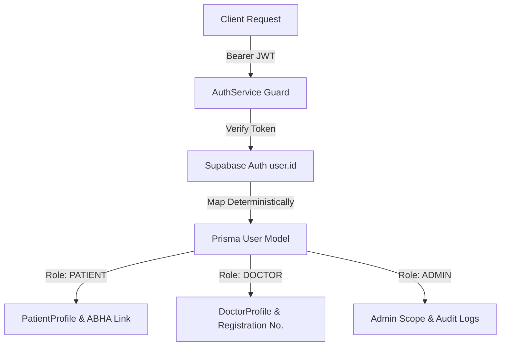

# AyurSetu (MediMindAi) — Authorization & RBAC Architecture

**Application**: AyurSetu (Smart Multilingual Patient Case-Taking & Clinical Decision Support)  
**Organization**: Ministry of Ayush / AIIA  
**Specification Level**: Production Enterprise Healthcare Grade  

---

## 1. Executive Identity Model

AyurSetu enforces a strict dual-layer identity architecture linking cloud authentication to local relational clinical profiles:

### Identity Entity Relationships
1. **Supabase Auth (`auth.users`)**: Canonical authentication authority issuing signed RS256/HS256 JWTs.
2. **Prisma `User`**: Core domain user record with:
   - `id`: System UUID (primary key for relational tables).
   - `supabaseUserId`: Unique identifier (`@unique`) mirroring Supabase `user.id`.
   - `role`: Enum `[PATIENT, DOCTOR, ADMIN]`.
   - `isActive`: Boolean status flag.
   - `deletedAt`: Soft-deletion timestamp.
3. **`PatientProfile`**: Associated 1:1 with `User.id` for role `PATIENT`.
4. **`DoctorProfile`**: Associated 1:1 with `User.id` for role `DOCTOR` (includes statutory registration number and specialization).

---

## 2. Server-Side Centralized Authorization (`AuthService`)

Located at [`lib/auth/auth-guard.ts`](file:///c:/Users/Hp/OneDrive/Desktop/SIH_2026/lib/auth/auth-guard.ts), `AuthService` provides deterministic security guards across all API routes:

| Guard Method | Security Assertion | Failure Response |
|---|---|---|
| `getAuthenticatedUser(req)` | Decodes Supabase Bearer token and resolves Prisma `User` with profiles | `null` |
| `requireUser(req)` | Asserts user is authenticated and active | `401 Unauthorized` |
| `requireRole(req, roles)` | Asserts user possesses one of the allowed roles | `403 Forbidden` |
| `requirePatient(req)` | Asserts authenticated user is a `PATIENT` with a valid `PatientProfile` | `403 Forbidden` |
| `requireDoctor(req)` | Asserts authenticated user is a `DOCTOR` or `ADMIN` | `403 Forbidden` |
| `requireAdmin(req)` | Asserts authenticated user is an `ADMIN` | `403 Forbidden` |
| `requireSessionAccess(req, sessionId)` | Resolves clinical session and verifies ownership or clinical assignment | `403 Forbidden` / `404 Not Found` |

---

## 3. IDOR Prevention & Clinical Boundary Rules

1. **Patient Isolation**:
   - A patient user can only read, write, or upload documents to sessions where `session.patient.userId === user.id`.
   - Any attempt to query or manipulate another patient's session returns `403 Forbidden` (or `404 Not Found` if non-existent).
2. **Doctor Clinical Scope**:
   - Doctors have queue access to clinical intake sessions in the hospital queue or explicitly assigned to their `DoctorProfile`.
   - Summary edits (`PUT /api/doctor/summary/[sessionId]`), summary acceptance (`POST /api/doctor/summary/[sessionId]/accept`), and summary rejection are strictly gated behind `requireDoctor`.
3. **Public Registration Role Lockdown**:
   - The public registration endpoint (`/api/auth/register`) rejects any attempts to assign the `ADMIN` role.
   - `DOCTOR` role registrations require statutory medical council registration numbers.
   - Default registrations automatically receive `PATIENT` role.

---

## 4. Protected Route Registry

| Route Pattern | Method | Minimum Auth | Authorization Rule |
|---|---|---|---|
| `/api/patient/session` | POST | Authenticated | Bound to `effectivePatientId` |
| `/api/patient/session` | GET | Authenticated | `requireSessionAccess` |
| `/api/patient/session/[id]/state` | GET | Authenticated | `requireSessionAccess` |
| `/api/patient/session/[id]/red-flags` | GET | Authenticated | `requireSessionAccess` |
| `/api/patient/conversation/*` | GET/POST | Authenticated | `requireSessionAccess` |
| `/api/patient/documents` | GET/POST | Authenticated | `requireSessionAccess` |
| `/api/patient/documents/upload` | POST | Authenticated | `requireSessionAccess` |
| `/api/patient/documents/[id]/entities` | GET | Authenticated | `requireSessionAccess` |
| `/api/consent/grant` | POST | Authenticated | Gated to caller's `patientProfile.id` |
| `/api/consent/revoke` | POST | Authenticated | Enforces patient record ownership |
| `/api/doctor/dashboard` | GET | DOCTOR / ADMIN | Verified doctor profile |
| `/api/doctor/case/[sessionId]` | GET | DOCTOR / ADMIN | `requireSessionAccess` |
| `/api/doctor/summary/[sessionId]` | GET/PUT | DOCTOR / ADMIN | `requireSessionAccess` + `requireDoctor` on PUT |
| `/api/doctor/summary/[sessionId]/accept`| POST | DOCTOR / ADMIN | `requireDoctor` + `requireSessionAccess` |
| `/api/doctor/summary/[sessionId]/reject`| POST | DOCTOR / ADMIN | `requireDoctor` + `requireSessionAccess` |
| `/api/doctor/export/his` | POST | DOCTOR / ADMIN | `requireDoctor` + `requireSessionAccess` |
| `/api/admin/audit` | GET | ADMIN | System Audit Log inspection |
| `/api/admin/analytics/overview` | GET | ADMIN | System Analytics aggregate inspection |
| `/api/admin/nodes` | POST | ADMIN | Dynamic question ontology management |
| `/api/admin/rules` | POST | ADMIN | Dynamic red flag rule management |
| `/api/admin/settings` | PUT | ADMIN | System configuration & feature flags |
| `/api/fhir/session/[sessionId]` | GET | Authenticated | `requireSessionAccess` |

---

## 5. Security & Verification Suite

The comprehensive test harness [`tests/test-runner.ts`](file:///c:/Users/Hp/OneDrive/Desktop/SIH_2026/tests/test-runner.ts) tests 16 core authentication and RBAC specifications (**AUTH-001 through AUTH-016**):
- **AUTH-001 to AUTH-003**: 401 Unauthorized on anonymous access to Patient, Doctor, Admin routes.
- **AUTH-004 to AUTH-007**: Patient profile resolution & cross-patient consultation IDOR rejection.
- **AUTH-008 to AUTH-009**: Doctor role gating and clinical assignment enforcement.
- **AUTH-010 to AUTH-011**: Doctor and Patient role rejection on Admin routes (403 Forbidden).
- **AUTH-012 to AUTH-013**: Blocked public self-promotion to ADMIN; safe PATIENT defaults.
- **AUTH-014**: Immediate rejection of expired/tampered JWTs.
- **AUTH-015**: Parameter tampering / IDOR resistance.
- **AUTH-016**: Resilient fail-closed security posture during database network interruptions.
