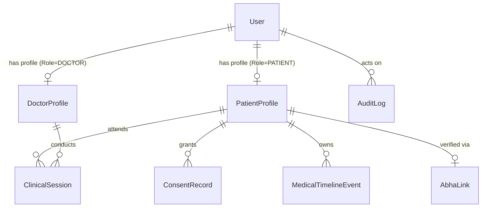

# 🔐 AYURSETU — NextAuth to Prisma Production Identity Migration Plan
**Document Version:** 1.0.0-PROD  
**Target Repository:** `Nik-coder-10/MediMindAi`  
**Status:** Architectural Specification  

---

## 1. Executive Summary & Objective

The current AyurSetu authentication pipeline in `lib/auth/auth.ts` uses simulated NextAuth v5 credentials providers that bypass database verification and mint static mock identities (`usr-doctor-demo-uuid`, `usr-patient-demo-uuid`, `usr-admin-demo-uuid`).

The objective of this migration plan is to transition AyurSetu to **genuine cryptographic database authentication** powered by the existing `prisma.user`, `prisma.patientProfile`, and `prisma.doctorProfile` models without breaking any clinical relationships or creating duplicate identity tables.

---

## 2. Identity Model Mapping



### Prisma Entity Mapping Table

| User Role | NextAuth Identity Source | Prisma Table Link | Primary Key | Profile Model |
| :--- | :--- | :--- | :--- | :--- |
| **PATIENT** | Mobile Phone + OTP / ABHA | `User` (`role: PATIENT`) | `User.id (UUID)` | `PatientProfile` (`userId`) |
| **DOCTOR** | Email + Bcrypt Password Hash | `User` (`role: DOCTOR`) | `User.id (UUID)` | `DoctorProfile` (`userId`) |
| **ADMIN** | Email + Bcrypt Password Hash | `User` (`role: ADMIN`) | `User.id (UUID)` | N/A (Direct `User` model) |
| **NURSE** | Email + Bcrypt Password Hash | `User` (`role: NURSE`) | `User.id (UUID)` | N/A (Care Team member) |

---

## 3. Step-by-Step Production Auth Migration

### Step 1: Password Hashing with Bcrypt
1. Install `bcryptjs` and `@types/bcryptjs`.
2. When creating doctors or administrators during registration / system provisioning:
   ```ts
   const passwordHash = await bcrypt.hash(rawPassword, 12);
   await prisma.user.create({
     data: { email, passwordHash, role: Role.DOCTOR, doctorProfile: { create: { registrationNumber, ... } } }
   });
   ```

### Step 2: NextAuth `CredentialsProvider` DB Lookup
Replace the mock authorization block in `lib/auth/auth.ts`:
```ts
CredentialsProvider({
  id: "credentials",
  name: "Doctor / Admin Login",
  async authorize(credentials) {
    if (!credentials?.email || !credentials?.password) return null;
    const email = String(credentials.email).toLowerCase().trim();
    
    const user = await prisma.user.findUnique({
      where: { email },
      include: { doctorProfile: true }
    });
    
    if (!user || !user.passwordHash || !user.isActive) return null;
    
    const isValid = await bcrypt.compare(String(credentials.password), user.passwordHash);
    if (!isValid) return null;
    
    return {
      id: user.id,
      email: user.email,
      name: user.doctorProfile ? `Dr. ${user.doctorProfile.registrationNumber}` : user.email,
      role: user.role,
      preferredLanguage: user.preferredLanguage,
    };
  }
})
```

### Step 3: Patient Phone OTP Verification Pipeline
1. Connect `/api/auth/otp/send` to an SMS gateway (e.g. NIC SMS / Twilio / MSG91).
2. Store hashed OTP with 5-minute TTL in Redis or `verification_tokens` table.
3. In `phone-otp` provider:
   ```ts
   const user = await prisma.user.upsert({
     where: { phone },
     create: {
       phone,
       role: Role.PATIENT,
       preferredLanguage: "hi",
       patientProfile: { create: { firstName: "Patient", lastName: phone.slice(-4), dateOfBirth: new Date(), gender: Gender.UNKNOWN } }
     },
     update: {},
     include: { patientProfile: true }
   });
   ```

---

## 4. API Authorization & Session Guard Matrix

All Next.js App Router route handlers will enforce role checks:

| API Route Pattern | Required Role | Authorization Check Implementation |
| :--- | :--- | :--- |
| `/api/doctor/*` | `DOCTOR`, `ADMIN` | `const session = await auth(); if (!session \|\| session.user.role !== "DOCTOR") throw AppError.unauthorized();` |
| `/api/admin/*` | `ADMIN` | `const session = await auth(); if (!session \|\| session.user.role !== "ADMIN") throw AppError.forbidden();` |
| `/api/patient/session/*` | `PATIENT`, `DOCTOR` | Validate `session.user.id === clinicalSession.patient.userId` or caller is active assigned doctor |
| `/api/patient/documents/upload` | `PATIENT`, `DOCTOR` | Require valid session token; bind `patientId` directly to `session.user.id` |

---

## 5. Rollout Checklist & Security Guarantees
- [ ] No hardcoded passwords in codebase.
- [ ] NextAuth secret (`NEXTAUTH_SECRET`) enforced to be minimum 32 random alphanumeric characters.
- [ ] Database session tokens signed with HS256/RS256.
- [ ] Zero simulated identities in production logs or audit trails.
