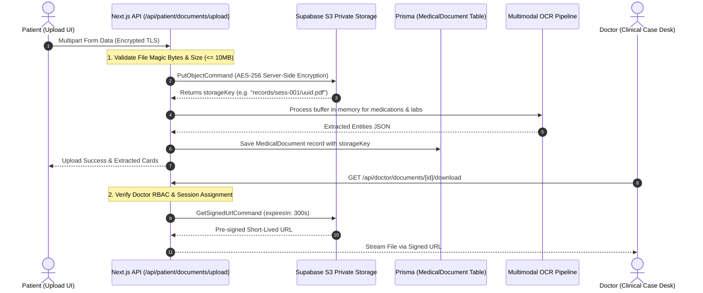

# 📦 AYURSETU — Multimodal Document Storage Migration Plan
**Document Version:** 1.0.0-PROD  
**Target Repository:** `Nik-coder-10/MediMindAi`  
**Status:** Architectural Specification  

---

## 1. Executive Summary & Objective

In the current demo setup, uploaded medical records (prescriptions, discharge summaries, laboratory panels) receive simulated paths such as `/uploads/documents/${Date.now()}_${fileName}` in [`app/api/patient/documents/upload/route.ts`](file:///c:/Users/Hp/OneDrive/Desktop/SIH_2026/app/api/patient/documents/upload/route.ts).

Because medical documents contain Sensitive Personal Data and Protected Health Information (PHI) governed by India's DPDP Act 2023 and ABDM Data Privacy Guidelines:
1. **Medical records must NEVER be publicly readable.**
2. **Files must be persisted to private, encrypted S3-compatible cloud object storage (e.g. Supabase Storage / AWS S3 / MinIO).**
3. **Retrieval must exclusively happen via short-lived pre-signed download URLs generated server-side after patient/doctor authorization.**

---

## 2. Storage Architecture & Life Cycle



---

## 3. Storage Implementation Specifications

### S3 / Supabase Storage Configuration
* **Target Bucket:** `ayursetu-medical-records` (Access Level: **PRIVATE**)
* **Bucket Policy:** Deny all anonymous GET / LIST operations.
* **Server-Side Encryption:** `AES256` or `aws:kms`.

### Key Structure Convention
```
records/
  ├── {patientId}/
  │     ├── {sessionId}/
  │     │     ├── {timestamp}-{randomUUID}-{sanitizedFileName}.pdf
```

### Storage Client Code (`lib/storage/s3-client.ts`)
The existing [`lib/storage/s3-client.ts`](file:///c:/Users/Hp/OneDrive/Desktop/SIH_2026/lib/storage/s3-client.ts) is already built with `@aws-sdk/client-s3` and `@aws-sdk/s3-request-presigner`.
For Supabase Storage compatibility:
```ts
export const s3Client = new S3Client({
  region: process.env.S3_REGION || "ap-south-1",
  endpoint: process.env.S3_ENDPOINT || `https://${process.env.SUPABASE_PROJECT_ID}.supabase.co/storage/v1/s3`,
  forcePathStyle: true,
  credentials: {
    accessKeyId: process.env.S3_ACCESS_KEY_ID!,
    secretAccessKey: process.env.S3_SECRET_ACCESS_KEY!,
  },
});
```

---

## 4. Security & DPDP Compliance Controls

1. **Malicious Executable & Polyglot Prevention:**
   - Verify magic bytes for `application/pdf` (`%PDF`), `image/png` (`\x89PNG`), `image/jpeg` (`\xFF\xD8\xFF`), and `image/webp` (`RIFF...WEBP`).
   - Reject any executable extensions (`.exe`, `.sh`, `.bat`, `.js`, `.html`).
2. **File Size Limits:**
   - Strict 10 MB per file limit enforced at route gateway.
3. **Audit Logging on Access:**
   - Every pre-signed download generation must record an `AuditLog` entry: `DOCUMENT_ACCESSED` with `actorId` and `ipAddress`.
4. **Data Retention & Right to be Forgotten:**
   - Soft-deleted documents trigger S3 `DeleteObjectCommand` upon permanent deletion request.
