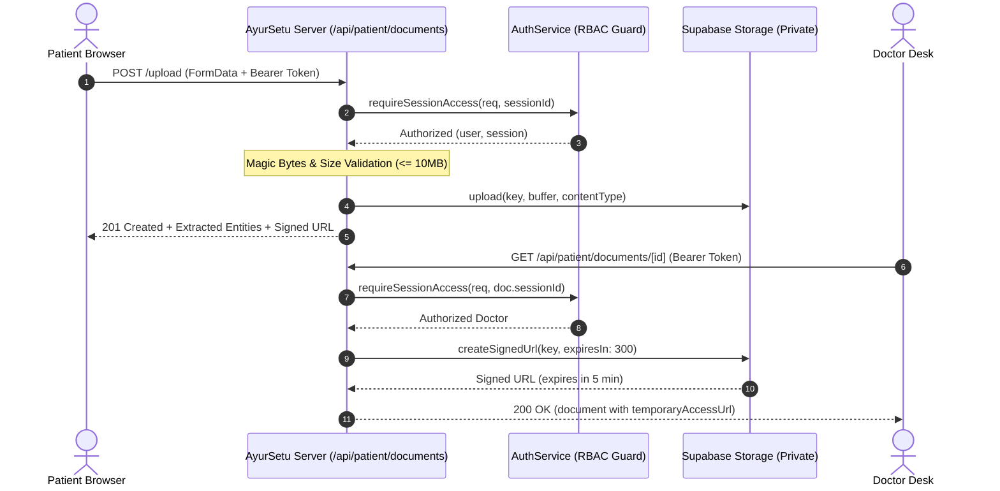

# 🏥 AyurSetu — Private Storage Architecture & Bucket Setup

**Application**: AyurSetu (Multilingual Patient Case-Taking & Clinical Decision Support)  
**Organization**: Ministry of Ayush / AIIA  
**Specification Level**: Production Enterprise Healthcare Grade  
**Governing Laws**: India DPDP Act 2023, ABDM Health Data Management Policy  

---

## 1. Bucket Specifications

| Property | Value | Notes |
|---|---|---|
| **Bucket Name** | `medical-documents` | Configured via `SUPABASE_STORAGE_BUCKET` |
| **Access Level** | **PRIVATE** | Public read access is strictly denied |
| **Max File Size** | 10 MB (`10485760` bytes) | Enforced server-side before object upload |
| **Supported MIME Types** | `application/pdf`, `image/jpeg`, `image/png`, `image/webp`, `text/plain` | Magic bytes inspected server-side |
| **Server-Side Encryption** | AES-256 | Automated object encryption at rest |

---

## 2. Deterministic Object Key Schema

Document object keys follow a deterministic, collision-proof hierarchy:

```
patients/{patientId}/{documentId}/original.{ext}
```

- `patientId`: UUID of the patient profile or `anonymous-patient` for unlinked intake.
- `documentId`: Server-generated UUID (RFC 4122).
- `original.{ext}`: Sanitized extension matching validated binary format (`.pdf`, `.jpg`, `.png`, `.webp`, `.txt`).

> [!CAUTION]
> Clients are **never** permitted to dictate storage keys or path prefixes. Path traversal patterns (`..`, leading slashes) are rejected immediately by `SupabaseStorageService`.

---

## 3. Storage Security & Access Control



1. **Private Bucket Policy**: Direct access to bucket files via unauthenticated HTTP GET returns `403 Forbidden`.
2. **Short-Lived Signed URLs**: Access is only granted via temporary pre-signed URLs generated server-side with a 300-second (5 minute) TTL.
3. **No Service-Role Key in Client**: `SUPABASE_SERVICE_ROLE_KEY` is strictly server-only and excluded from `NEXT_PUBLIC_` bundles.

---

## 4. Failure Recovery & Orphaned Object Cleanup

- **Database Insert Failure**: If `prisma.medicalDocument.create` fails after an object has been uploaded, `SupabaseStorageService.deleteDocument(key)` is invoked immediately to purge the orphaned blob.
- **OCR Parsing Warnings**: If OCR encounters unreadable images, the raw document remains safely stored in the private bucket and an empty OCR result is recorded without deleting the original file.
- **Soft Deletion & DPDP Compliance**: When a document is deleted (`DELETE /api/patient/documents/[id]`), the database record receives a `deletedAt` timestamp and the underlying object is removed from the storage bucket.
